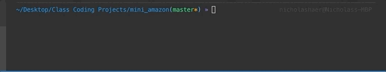
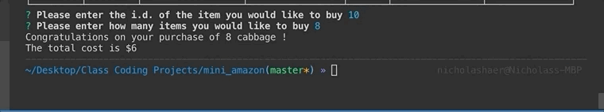
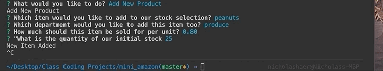
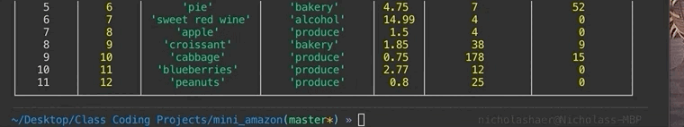
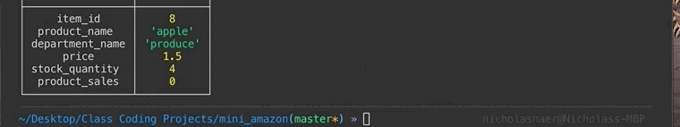

# mini_amazon
A node application made to practice incorporating a sql database into a web app.

This application is made in Node, and is connected to a a MySQL database with mysql tools.

This project is built to resemble a microcosm of amazon. There are three different roles a user can take, that of a customer, manager, or manager.

A customer can buy items, which will update the database to the correct quantity in stock, and then update product sales as well. This table is used alongside a table of departments to provide a more complete picture for the manager view.

The manager view allows for viewing stock and sales, viewing only items that are low in stock, adding stock of specific items to inventory, and adding new items to the selection.

The supervisor view shows what the manager sees when he view inventory and sales, but also adds a column showing total profit or loss. Supervisors can also add new departments.

I greatly enjoyed this project, as it was rewarding to see part of how a web apps backend works after several months working on front end material. Also, as a sociologist and archaeologist, I have a fascination with data, especially in it's usage to find answers, a process facillitated with the addition of SQL to a much greater degree than I had been capable of before

This was my first time using SQL, and I spent several hours learning how to work with complex data, part of which comes through in the queries found in this project. My greatest challenge came from making a fully comprehensive case statement under the supervisors section. I liked that section best of all, especially crafting all the parts of descriptive SQL queries.

Technologies Used:

* JavaScript
* SQL
* Node
* Inquirer
* MYSQL npm package
* giphy gif capture

Find the code for this project here.

https://github.com/Nick-Haer/mini_amazon

Find screenshots of the app working here, split into each role the user can adopt:

---------------------------------

----------------------------------

